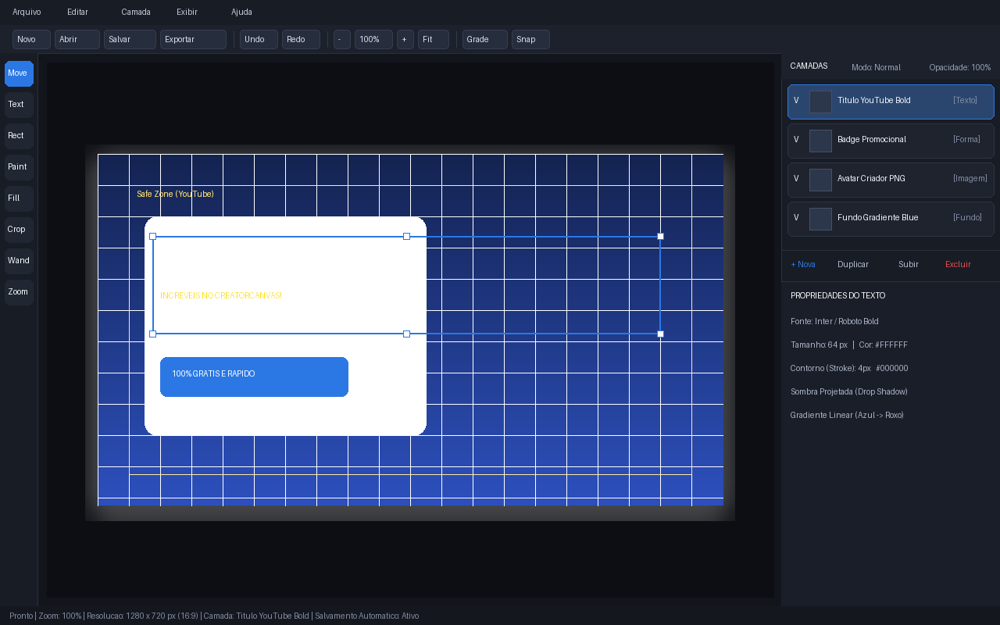
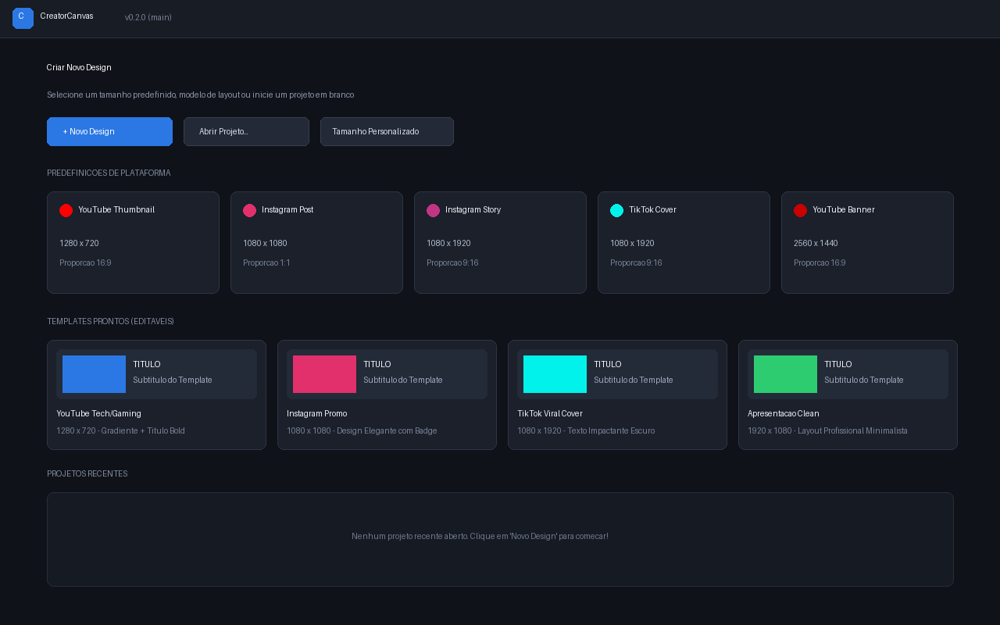

# CreatorCanvas

A fast, layer-based image editor designed specifically for digital content creators — YouTube thumbnails, social posts, stories, banners, and marketing graphics. Combines template-driven simplicity with a real layer and non-destructive command stack, optimized for Linux and Windows.

> **Status:** Current `main` is ahead of **v0.2.0** (includes multi-select, layout templates, grid/safe zones, icon suite, modular `cc_tools` architecture, and Photoshop-style layer drag-and-drop).

---

## Interface Overview



*Main Editor Workspace: Multi-layer canvas, transform handles, smart grid & safe zones, quick access toolbar, and inspector docks.*

<br/>



*Welcome & Start Screen: Preset cards for YouTube/Instagram/TikTok, ready-to-edit templates, and recent project thumbnails.*

---

## Key Features

- **Layer-Based Compositing** — Support for Image, Text, Shape, Group, and Background layers with Photoshop-style drag-and-drop reordering, visibility, locking, opacity, and blend modes.
- **Ready-to-Use Templates** — Built-in editable layout templates (`TemplateFactory`) for YouTube, Instagram, TikTok, and presentations.
- **Multi-Layer Selection & Tools** — Shift-click and rubber-band multi-select, alignment & distribution, grouping, and transform gestures.
- **Smart Guides & Safe Zones** — Toggleable alignment grid, snap-to-grid, and safe zone overlays for YouTube, Instagram, and TikTok.
- **Text & Graphic Styling** — Rich text inspector with outline, drop-shadow, linear/radial color gradients, and transform shear (X/Y).
- **Raster & Painting Suite** — Modular `ICanvasTool` architecture (`cc_tools`): Brush, Pencil, Airbrush, Eraser, Flood Fill, Crop, Polygon Cut (Scissors), Magic Wand, and Clone Stamp.
- **Offline AI Background Removal** — Integrated ONNX Runtime (`u2netp`) for single-click background removal.
- **Undo / Redo System** — Fully non-destructive command stack (`core/history/`) for all operations including layer reordering.
- **Native Localization** — Full English and Brazilian Portuguese (pt-BR) support with live language switching.

---

## Tech stack

| Component | Choice |
|---|---|
| Language | C++20 |
| Framework | Qt 6 (Widgets). Reference/deployment toolchain **Qt 6.8 LTS**; builds tolerate **6.2+** |
| Build | CMake ≥ 3.24 with presets `linux-debug`, `linux-asan`, `linux-release`, `windows-debug`, `windows-release` |
| Rendering | `cc::renderDocument()` in `src/rendering/` — software `QPainter` only. No `IRenderer` interface and no GPU backend yet |
| Tool Architecture | Modular `ICanvasTool` / `ToolContext` in static library `cc_tools` (`src/tools/`) |
| Raster ops | `cc::ImageProcessing` (`src/core/image/`) — paint, fill, crop, wand, scissors, clone, color filters |
| Imaging | `QImage` + Qt image plugins (PNG/JPEG/WebP) |
| Project container | ZIP (vendored `miniz`) holding `manifest.json` + `media/` + `thumbnail.png` |
| Testing | QTest, **20** unit-test executables in `tests/CMakeLists.txt` |
| AI / ML | ONNX Runtime (background removal, C API) |
| Packaging | AppImage + DEB (Linux), portable ZIP / NSIS (Windows) |

## Project size

Approximate counts on current `main` (`.cpp` / `.h` only, excluding `3rdparty/`):

| Area | Lines |
|---|---|
| `src/ui` | ~11,000 |
| `src/core` (includes serialization, snap, image, templates) | ~4,200 |
| `src/tools` (`ICanvasTool` suite) | ~1,050 |
| `src/services` | ~715 |
| `src/localization` | ~340 |
| `src/rendering` | ~330 |
| `src/imageio` (compiled into `cc_core`) | ~190 |
| **Production `src/` total** | **~17,900** |
| `tests/unit` | ~3,500 |

Largest files: `src/ui/canvasview.cpp` (~2,600) and `src/ui/mainwindow.cpp` (~2,300).

## Prerequisites

- CMake ≥ 3.24, Ninja (recommended), a C++20 compiler (GCC 11+, Clang 14+, MSVC 2022)
- Qt 6.x development packages (Core, Gui, Widgets, Test)

## Build & test — Linux

```bash
sudo apt install build-essential cmake ninja-build \
    qt6-base-dev qt6-base-dev-tools libgl1-mesa-dev

./scripts/fetch_onnx.sh
cmake --preset linux-debug
cmake --build --preset linux-debug
ctest --test-dir build/linux-debug --output-on-failure
./build/linux-debug/bin/CreatorCanvas
```

## Build & test — Windows (VS 2022 developer prompt, Qt installed)

```bat
scripts\fetch_onnx.bat
cmake --preset windows-debug
cmake --build --preset windows-debug --config Debug
ctest --test-dir build/windows-debug -C Debug --output-on-failure
build\windows-debug\bin\Debug\CreatorCanvas.exe
```

Running outside a Qt environment requires the Qt DLLs on `PATH`; the packaging scripts under `packaging/windows/` handle deployment.

## Sanitizer build (Linux)

```bash
cmake --preset linux-asan
cmake --build --preset linux-asan
ASAN_OPTIONS=detect_leaks=0 ctest --test-dir build/linux-asan --output-on-failure
```

## Packaging

```bash
packaging/linux/build_appimage.sh   # AppImage
packaging/linux/build_deb.sh        # .deb
packaging/windows/build_portable.ps1  # Windows portable ZIP
```

## Milestones

Phase 1 (M0–M15) and Phase 2 (M16–M20) shipped in **v0.2.0**. Items below M20 exist on `main` and are not in that tag.

| # | Milestone | Status |
|---|---|---|
| M0 | Application skeleton | Done |
| M1 | Core document/layer model | Done |
| M2 | Undo/redo history | Done |
| M3 | Project save/open (v1 serialization) | Done |
| M4 | Canvas view (pan/zoom) | Done |
| M5 | New Document dialog | Done |
| M6 | Image import + transform (handles, rotate/scale/flip) | Done |
| M7 | Layers panel | Done |
| M8 | Text tool (+ inspector) | Done |
| M9 | Text effects (outline, drop shadow) | Done |
| M10 | Menus, shortcuts, settings dialog | Done |
| M11 | Export (PNG/JPEG/WebP) | Done |
| M12 | Autosave + crash recovery | Done |
| M13 | Start screen (presets + recents) | Done |
| M14 | Packaging (AppImage, DEB, Windows portable) | Done |
| M15 | Smart guides & snapping | Done |
| M16 | Paint & Flood Fill tools | v0.2.0 |
| M17 | Text gradient effects (linear + radial) | v0.2.0 |
| M18 | Shear / tilt on affine transform | v0.2.0 |
| M19 | Image Inspector (adjustments + presets) | v0.2.0 |
| M20 | AI background removal | v0.2.0 |
| M21 | Multi-select, align/distribute/group, grid, safe zones, templates, extra raster tools | on `main` |
| M22 | Modular tools architecture (`cc_tools`, `ICanvasTool`) & Photoshop-style layer drag-and-drop | on `main` |

## Project structure

```
creatorcanvas/
├── CMakeLists.txt
├── CMakePresets.json
├── src/
│   ├── main.cpp
│   ├── core/            # Document, layers, history, serialization, geometry, snap,
│   │                    # ImageProcessing, BackgroundRemover, TemplateFactory
│   ├── tools/           # Modular tool system: ICanvasTool, SelectTool, CropTool,
│   │                    # PaintTool, ScissorsTool, RasterTools (cc_tools)
│   ├── rendering/       # renderDocument() — software QPainter compositor
│   ├── ui/              # MainWindow, CanvasView, panels, dialogs, StartScreen
│   ├── services/        # Settings, Autosave, RecentFiles, PresetStore, Log
│   ├── localization/    # I18nService
│   └── imageio/         # ImageImporter, DocumentExporter (linked into cc_core)
├── resources/
│   ├── locales/{en,pt-BR}/{common,editor,settings,templates}.json
│   ├── presets/builtin.json
│   └── icons/
├── tests/unit/          # 20 QTest executables
├── packaging/{linux,windows}/
└── DOCUMENTATION.md
```

CMake libraries: `cc_core`, `cc_tools`, `cc_rendering`, `cc_services`, `cc_localization`, plus the `creatorcanvas` executable (output name `CreatorCanvas`).

## Conventions

- **No hardcoded user-facing strings.** Everything resolves through `I18nService::t(namespace, key)`, backed by JSON catalogs in `resources/locales/<lang>/`. Missing keys fall back to English, then to a humanized key, with a logged warning.
- **Document mutation should go through Commands** (`core/history/`). `Layer` still exposes several public fields (`name`, `visible`, `locked`, `transform`, …); do not write those from UI except through `Document` / commands.
- **`core/` never depends on QtWidgets** — only QtCore/QtGui, so it is unit-testable headless.
- **Prefer `QStandardPaths` / `QDir` over `#ifdef`.** There is **no `platform/` directory** yet. OS branches currently live in CMake (`if(WIN32)`) and a few sources (e.g. ONNX library paths in `BackgroundRemover`).
- `std::unique_ptr` members of `Q_OBJECT` classes require a full `#include`, not a forward declaration.
- Free functions in `cc::` should be called with an explicit `cc::` qualifier where a member of the same name could shadow them.

See `DOCUMENTATION.md` for architecture, format, tests, and known limitations.

## Release checklist

Before tagging a new release:
1. **Unit tests**: `ctest --output-on-failure` passes across all **20** test executables.
2. **Clean packaging**: Build `.deb` (Linux) and portable ZIP (Windows); verify `libonnxruntime` is staged inside the package.
3. **Smoke testing**: Run `CreatorCanvas --smoke-test` on the installed package in headless mode (`QT_QPA_PLATFORM=offscreen`).
4. **Model resolution**: Verify `u2netp.onnx` is bundled in `share/creatorcanvas/models/` or the browse prompt works cleanly.
5. **Consistency**: CMake `project(VERSION …)`, installer versions, README, and `DOCUMENTATION.md` describe the same tree.

## Note

I have to take a break on this project for now but I will try add more things for next version.

## License

MIT — see `LICENSE`.

Third-party runtime components: Qt 6 (LGPLv3 — dynamically linked, notices shipped with installers), ONNX Runtime (MIT — dynamically linked), and `miniz` (public domain, vendored). See `NOTICE.md` for full details and distribution obligations.
